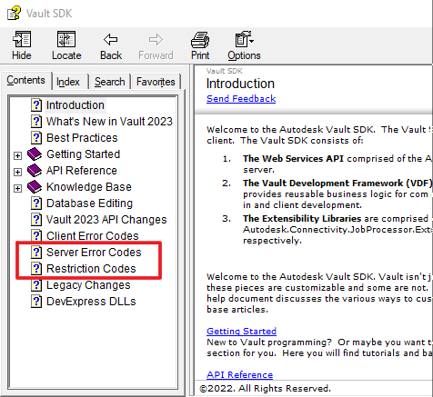

# Summary
The Vault Exception Parser helps to parse Vault Errors and Restrictions from generic numbers to the actual message found in the Server Errors and Restrictions tables listed in the API documentation. To ensure the correct errors are returned you must use the VaultExceptionParser assembly that matches the year version of Vault Server returning the errors. This version of the VaultExceptionParser is intended for all flavors of Autodesk Vault 2024.

###### Codes Available in this library...


## Setup
To make the library available for use in your application add the VaultExceptionParser2024.dll as a reference to your project.
Make sure the VaultExceptionParser2024.dll is deployed with your library/application to avoid file not found exceptions when parsing an exception. 

## Use
The Vault Exception Parser contains all static methods and properties and is initialized upon first use, therefor you do not need to instantiate any objects on your own.
Simply call the `ParseVaultException()` extension method from any Exception object.

```C#
try{
      /* Some code containing Vault API calls */
}
catch(Exception ex)
{
   /* 
      If the exception is a valid Vault Exception then the full error or restriction message is returned with 
      the original exception added as the InnerException, otherwise the original exception is returned. 
   */
   throw ex.ParseVaultException();
}
```
    
### Additional Versions
-	VaultExceptionParser2020
-	VaultExceptionParser2021
-	VaultExceptionParser2022
-	[VaultExceptionParser2023](https://github.com/Futemire/VaultExceptionParser2023)
-	VaultExceptionParser2024 (This Repo)

<hr/>

## Donations

Everyone's time is valuable, including the time it took me to develop this library, so if you use and like this code please consider doanting.

<a href="https://www.paypal.com/donate/?hosted_button_id=KF5GUDY36NHJ8">
      
</a>
